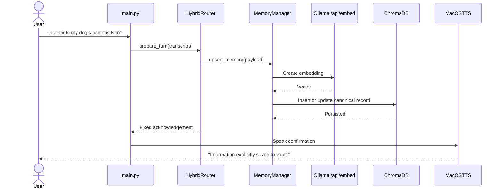
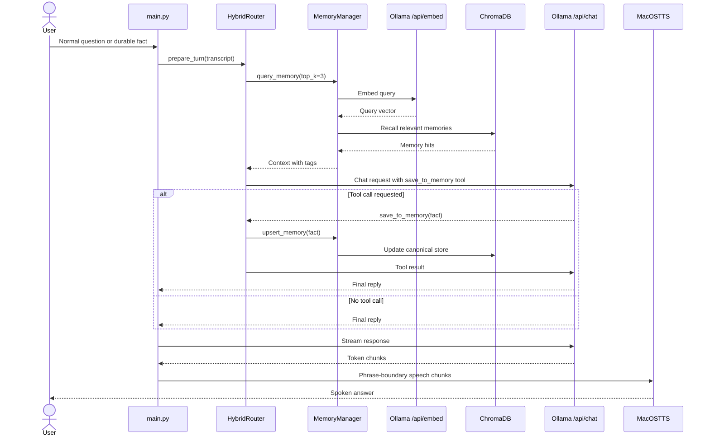
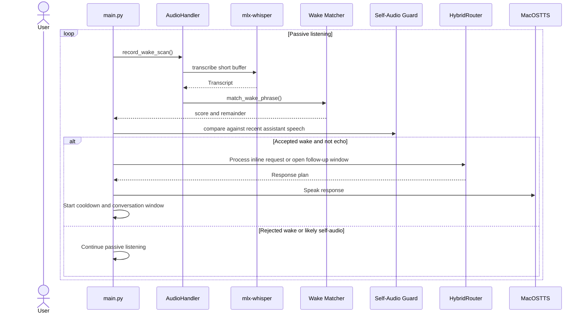

# Lulu VAIA

Lulu VAIA is a fully local, Apple Silicon-first voice-to-voice AI assistant for macOS. It uses `mlx-whisper` for speech-to-text, Ollama for chat plus embeddings, ChromaDB for persistent long-term memory, and the native macOS `say` command for zero-setup text-to-speech.

This current product baseline is designed for a Mac M1 workflow in July 2026:

- No cloud inference
- No CUDA
- No PyTorch/CUDA runtime
- Native Ollama endpoints on `http://localhost:11434`
- Persistent semantic memory in `./vault_db`

## Documentation

- [Documentation Index](./docs/README.md)
- [Installation And Operations Runbook](./docs/operations.md)
- [Reconstructed Product Requirements Document](./docs/prd.md)
- [Decision Log](./docs/decision-log.md)
- [Original Project Blueprint](./Project_Blueprint_AI_Assistant.md)

Use these docs by role:

- `README.md`: setup, runtime modes, and day-to-day operator guidance
- `docs/operations.md`: production-style installation, startup, supervision, and troubleshooting workflows
- `docs/prd.md`: reconstructed product scope, requirements, user stories, and success metrics
- `docs/decision-log.md`: strategic and technical rationale behind the current architecture
- `docs/implementation-plans/`: milestone-by-milestone implementation plans and verification notes
- `Project_Blueprint_AI_Assistant.md`: original vision and early design intent

## Prerequisites

Before you install Lulu on a fresh system, make sure you have:

- macOS on Apple Silicon
- Homebrew installed and available in your shell
- internet access for Homebrew packages and Ollama model downloads
- microphone hardware available to the current user session
- permission to allow microphone access for your terminal or IDE host process

## Quick Start

Use the production-style scripts from the repo root:

```bash
chmod +x scripts/install_lulu.sh scripts/start_lulu.sh
./scripts/install_lulu.sh
./scripts/start_lulu.sh
```

Quick checks:

- Validate installation actions without changing the machine: `./scripts/install_lulu.sh --dry-run`
- Verify startup prerequisites without launching Lulu: `./scripts/start_lulu.sh --check`
- Start text mode: `./scripts/start_lulu.sh --mode text`
- Start turn-based mode: `./scripts/start_lulu.sh --mode turn-based`

## What Lulu Does

Lulu has a hybrid memory router with two paths:

### 1. Explicit Memory Save

If you say:

```text
insert info my dog's name is Nori
```

Lulu will:

1. Skip the chat model
2. Embed the payload with `nomic-embed-text`
3. Deduplicate semantically against existing canonical memories
4. Assign 1-3 backend tags locally
5. Insert or update the canonical memory in ChromaDB
6. Confirm with speech: `Information explicitly saved to vault.`

### 2. Autonomous Chat + Tool-Calling Memory

For normal speech, Lulu will:

1. Query ChromaDB for the top 3 relevant memories
2. Inject those memories, including their backend tags, into the system prompt
3. Call Ollama `POST /api/chat` with a JSON-schema tool named `save_to_memory`
4. Let the model decide whether the user shared a durable fact worth remembering
5. Save the fact natively in Python if the tool is called
6. Generate a final spoken reply

The router intentionally allows only one tool-execution round per turn to avoid recursive tool loops.

### Canonical Memory Rules

Lulu now stores long-term memory as canonical records:

- semantic near-duplicates update the existing record instead of creating noisy copies
- backend classification assigns 1-3 free-form tags such as `tea`, `preference`, `schedule`, or `dentist`
- conflicting facts in the same semantic slot follow latest-wins behavior
- recalled memories show both text and tags to the model for better context quality

## Architecture

```text
Microphone
  -> sounddevice + numpy VAD
  -> mlx-whisper transcription
  -> HybridRouter
     -> Explicit path: Chroma upsert
     -> Chat path:
        -> Chroma semantic recall
        -> Ollama /api/chat
        -> optional save_to_memory tool call
        -> final reply
  -> macOS say
```

## Core System Flows

### Explicit Memory Save



### Conversational Turn With Optional Memory Tool



### Continuous Listening And Wake Flow



## Project Structure

```text
.
├── .env.example
├── .gitignore
├── README.md
├── Project_Blueprint_AI_Assistant.md
├── docs
│   ├── README.md
│   ├── decision-log.md
│   ├── implementation-plans
│   │   ├── a1-memory-deduplication-and-categories.md
│   │   ├── b1-chunked-tts-streaming.md
│   │   └── c1-wake-word-continuous-listening.md
│   ├── operations.md
│   └── prd.md
├── audio_handler.py
├── config.py
├── llm_router.py
├── main.py
├── memory_manager.py
├── ollama_client.py
├── terminal_ui.py
├── requirements.txt
├── scripts
│   ├── install_lulu.sh
│   ├── memory_inspect.py
│   └── start_lulu.sh
└── tests
    ├── test_continuous_listening.py
    ├── test_llm_router.py
    ├── test_memory_manager.py
    └── test_streaming_tts.py
```

## Installation

### Preferred Scripted Workflow

For a fresh machine or a clean bootstrap, use the tracked scripts:

```bash
chmod +x scripts/install_lulu.sh scripts/start_lulu.sh
./scripts/install_lulu.sh
./scripts/start_lulu.sh
```

What the installer does:

1. validates macOS/Homebrew prerequisites
2. installs or verifies `python@3.12`, `portaudio`, `ffmpeg`, and `ollama`
3. creates `.env` from `.env.example` if needed
4. creates `.venv` and installs `requirements.txt`
5. starts Ollama if it is offline
6. validates or pulls the required Ollama models
7. verifies the Python runtime imports cleanly

What the startup wrapper does:

1. loads `.env`
2. verifies `.venv`
3. verifies or starts Ollama
4. checks required Ollama models
5. launches Lulu in the selected mode
6. monitors the process and performs graceful shutdown on `SIGINT` or `SIGTERM`

### Manual Apple Silicon Setup

### 1. Install system dependencies

```bash
brew update
brew install python@3.12 portaudio ffmpeg ollama
```

Notes:

- `portaudio` is required by `sounddevice`
- `ffmpeg` is useful for audio tooling and troubleshooting
- `ollama` provides the local model runtime

### 2. Create a virtual environment

```bash
python3.12 -m venv .venv
source .venv/bin/activate
python -m pip install --upgrade pip setuptools wheel
pip install -r requirements.txt
```

Important:

- Activate the virtual environment in every new terminal session before running Lulu commands that use `python` or `pip`.
- If your shell says `python: command not found`, either reactivate the virtual environment with `source .venv/bin/activate` or use `python3` directly.

### 3. Start Ollama

If the desktop app is not already running:

```bash
ollama serve
```

### 4. Pull the local models

```bash
ollama pull llama3.2:3b
ollama pull nomic-embed-text
```

Optional STT model choice is configured by environment variable:

- Default for reliable wake detection: `mlx-community/whisper-base-mlx`
- Faster but less reliable for wake mode: `mlx-community/whisper-tiny-mlx`

### 5. Verify Ollama

```bash
curl http://localhost:11434/api/version
curl http://localhost:11434/api/tags
```

### 6. Grant microphone permission

On first use, macOS should prompt for microphone access for the terminal or IDE host process running Lulu.

## Runtime Startup

### Preferred Scripted Startup

Voice mode:

```bash
./scripts/start_lulu.sh
```

Text-input mode:

```bash
./scripts/start_lulu.sh --mode text
```

Turn-based troubleshooting mode:

```bash
./scripts/start_lulu.sh --mode turn-based
```

Prerequisite validation only:

```bash
./scripts/start_lulu.sh --check
```

## Run Lulu Manually

### Voice mode

```bash
source .venv/bin/activate
python main.py
```

Lulu now runs in always-on passive listening mode by default. It waits for the fixed wake phrase `hey lulu`, uses a conservative scored matcher to tolerate common Whisper-style confusions such as `hay lou lou`, opens a 12-second follow-up conversation window, then returns to passive listening automatically after the window expires.

Recommended voice flow:

- Say only `hey lulu`
- Wait for the conversation window to open in the dashboard
- Then say your request, such as `what time is it`

Inline requests like `hey lulu what time is it` can still work, but the two-step flow is more reliable because the wake-scan path is intentionally short and optimized for detection first.

The terminal now shows a small live dashboard with:

- current assistant mode such as `passive_listening`, `conversation_window`, `thinking`, and `speaking`
- a visible runtime badge showing `CONTINUOUS`, `TURN-BASED`, or `TEXT`
- a wake debug panel with the current score threshold, accepted/rejected counters, score bins, and recent accepted/rejected wake attempts
- latest transcript and spoken response
- recent memory saves
- a recent-turn event log for capture, transcription, recall, save, and response milestones
- per-turn latency snapshots for capture, STT, router, first token, first spoken chunk, TTS, and total turn time

Replies now stream into speech in grouped, smoothness-first chunks, so Lulu can begin talking before the full response is complete. The current policy buffers the first spoken chunk, prefers sentence boundaries, falls back to clause-aware breaks before hard splits, and merges tiny final tails backward when safe. This still favors lower latency than full-response playback, but some seams can remain because native macOS `say` is restarted per chunk.

While Lulu is speaking and briefly afterward, wake detection enters a software cooldown so the assistant does not immediately retrigger on its own TTS output. Lulu also applies a lightweight transcript-similarity guard for a short post-speech window to suppress likely self-audio echoes by comparing wake-scan transcripts against the recent final reply and recently spoken chunks.

If a core local dependency fails during startup or a turn, Lulu now surfaces a degraded but explicit operator-visible state in the dashboard instead of failing silently. Startup Ollama failures stop the app with a clear status line, while capture, transcription, streaming, and TTS failures remain visible in the event log and status panel so you can troubleshoot without losing the current text response.

### Text-input mode

This is useful for quick router and memory testing without live audio:

```bash
source .venv/bin/activate
python main.py --text-input
```

### Turn-based troubleshooting mode

Use this temporary fallback to bypass continuous listening and return to the older one-turn voice loop:

```bash
source .venv/bin/activate
python main.py --turn-based
```

### Memory inspection mode

Use the text-mode sanity script to inspect stored canonical memories without modifying the database:

```bash
source .venv/bin/activate
python scripts/memory_inspect.py --limit 10
python scripts/memory_inspect.py --query "What tea do I like?" --limit 3 --show-metadata
```

This is useful for checking:

- whether a repeated fact was merged instead of duplicated
- what backend tags were assigned
- which memory a semantic query would recall

## Environment Variables

The startup wrapper loads `.env` automatically if it exists. Start from `.env.example`, then override as needed:

```bash
cp .env.example .env
```

Core defaults:

```bash
export OLLAMA_BASE_URL="http://localhost:11434"
export OLLAMA_CHAT_MODEL="llama3.2:3b"
export OLLAMA_EMBED_MODEL="nomic-embed-text"
export MLX_WHISPER_MODEL="mlx-community/whisper-base-mlx"
export MLX_WHISPER_LANGUAGE="en"
export AUDIO_INPUT_DEVICE=""
export CHROMA_PATH="./vault_db"
export CHROMA_COLLECTION="lulu_memory"
export VAD_THRESHOLD="0.015"
export VAD_SILENCE_SECONDS="1.0"
export TOP_K_MEMORIES="3"
export MEMORY_DEDUP_SIMILARITY_THRESHOLD="0.92"
export MEMORY_DEDUP_QUERY_K="3"
export MEMORY_MAX_TAGS="3"
export MEMORY_TAG_CLASSIFIER_MODEL=""
export TTS_STREAM_MIN_CHUNK_CHARS="36"
export TTS_STREAM_START_BUFFER_CHARS="110"
export TTS_STREAM_GROUP_TARGET_CHARS="150"
export TTS_STREAM_MAX_GROUP_SENTENCES="2"
export TTS_STREAM_CLAUSE_BOUNDARY_CHARS="120"
export TTS_STREAM_TAIL_MERGE_CHARS="40"
export TTS_STREAM_TAIL_MERGE_OVERFLOW_CHARS="48"
export TTS_STREAM_SOFT_CHUNK_CHARS="150"
export TTS_STREAM_MAX_CHUNK_CHARS="240"
export WAKE_PHRASE="hey lulu"
export WAKE_SCAN_MAX_RECORD_SECONDS="3.0"
export WAKE_SCAN_MIN_SPEECH_SECONDS="0.25"
export WAKE_SCAN_SILENCE_SECONDS="0.45"
export WAKE_SCAN_PRE_ROLL_CHUNKS="6"
export CONVERSATION_WINDOW_SECONDS="12.0"
export WAKE_COOLDOWN_SECONDS="1.2"
export SELF_AUDIO_GUARD_SECONDS="8.0"
export SELF_AUDIO_SIMILARITY_THRESHOLD="0.74"
export WAKE_MATCH_SCORE_THRESHOLD="0.86"
export CONTINUOUS_LISTENING_ENABLED="true"
```

Script-level startup controls:

```bash
export LULU_AUTO_START_OLLAMA="true"
export LULU_RESTART_ON_FAILURE="true"
export LULU_MAX_RESTARTS="2"
export LULU_RESTART_BACKOFF_SECONDS="2"
```

## Important Implementation Notes

### Ollama Tool Calling

Lulu uses the native Ollama endpoint:

- Chat: `POST /api/chat`
- Embeddings: `POST /api/embed`

This matters because tool calls are handled using Ollama's native `tool_calls` format. The app does not rely on the OpenAI-compatible `/v1` layer for tool execution.

Tool follow-up messages are formatted like this:

```json
{
  "role": "assistant",
  "tool_calls": [
    {
      "type": "function",
      "function": {
        "name": "save_to_memory",
        "arguments": {
          "fact": "My flight is at 5 PM tomorrow."
        }
      }
    }
  ]
}
```

Then the Python app replies with a tool message:

```json
{
  "role": "tool",
  "tool_name": "save_to_memory",
  "content": "Saved memory: My flight is at 5 PM tomorrow."
}
```

### Safety Guardrails

- The model can request only one supported tool: `save_to_memory`
- Only one tool round is executed per user turn
- Tool arguments must be a JSON object
- `fact` must be a non-empty string within a configurable max length
- Memory deduplication uses a configurable semantic threshold and keeps one canonical active record
- Backend tag classification is validated in Python and falls back to `general` on parse failures
- Retrieved memory is treated as untrusted context, not executable instruction text
- TTS uses the native `say` binary through `subprocess.run([...])` instead of shell-interpolating model output
- Chunked playback is currently non-interruptible; interruption work is deferred to a future playback milestone

## Testing

Run the focused test suite:

```bash
pytest -q
# or, if pytest is not on your PATH:
python -m pytest -q
```

## Tuning Tips For M1

- Use `mlx-community/whisper-base-mlx` for the most reliable wake detection and everyday voice use
- Move to `mlx-community/whisper-tiny-mlx` only if you need lower STT latency and can tolerate weaker wake recognition
- Keep `MLX_WHISPER_LANGUAGE="en"` for the default `hey lulu` wake phrase unless you are intentionally changing Lulu to another spoken language
- Keep the chat model small for fast turn-taking
- If memory recall feels noisy, reduce `TOP_K_MEMORIES` to `2`
- If VAD misses speech, lower `VAD_THRESHOLD`
- If VAD clips too early, increase `VAD_SILENCE_SECONDS`

## Roadmap Ideas

- Replace macOS `say` with a higher-quality local TTS engine
- Add barge-in or interruption support during assistant playback
- Add memory confidence scoring
- Add richer structured memory taxonomies or human-reviewed conflict resolution
- Add explicit latency benchmarking and automated calibration reports

## Uninstall

Choose the level of removal that matches your goal.

### Remove Lulu Source Only

If you want to remove the project checkout and its local virtual environment, delete the repo directory from its parent folder:

```bash
cd ..
rm -rf lulu
```

This removes the Lulu source tree, local `.venv`, tracked docs, and any repo-local generated files.

### Remove Lulu Data But Keep The Repo

If you want to keep the source code but remove local runtime state and generated artifacts:

```bash
rm -rf .venv
rm -rf vault_db
rm -rf .pytest_cache .ruff_cache .mypy_cache
find . -type d -name __pycache__ -prune -exec rm -rf {} +
rm -f .env .env.*
```

This removes the local Python environment, persisted Lulu memory, local caches, and local environment files while keeping the tracked source code.

### Full Removal From This Mac

Only do this if the machine-wide dependencies below were installed specifically for Lulu and are not needed by other projects.

1. Remove the Ollama models used by Lulu:

```bash
ollama rm llama3.2:3b
ollama rm nomic-embed-text
```

2. If you installed Ollama and the other system dependencies with Homebrew for Lulu, remove them with Homebrew:

```bash
brew uninstall ollama
brew uninstall ffmpeg portaudio
brew uninstall python@3.12
```

Notes:

- `python@3.12`, `ffmpeg`, and `portaudio` may be shared with other local projects, so uninstall them only if you are sure you no longer need them.
- If Ollama was installed through the macOS app or another method instead of Homebrew, use the official [Ollama macOS uninstall steps](https://docs.ollama.com/macos) for the app-specific removal path.

3. Remove Ollama local data if you want a full cleanup of downloaded models, logs, and cache:

```bash
rm -rf ~/.ollama
rm -rf ~/Library/Application\ Support/Ollama
rm -rf ~/Library/Saved\ Application\ State/com.electron.ollama.savedState
rm -rf ~/Library/Caches/com.electron.ollama
rm -rf ~/Library/Caches/ollama
rm -rf ~/Library/WebKit/com.electron.ollama
```

Warning:

- Removing `~/.ollama` and the related Library paths deletes all local Ollama models and cached app data on this Mac, not just the models used by Lulu.

### Revoke Microphone Access

If you want to remove microphone access after uninstalling Lulu, revoke it for the terminal or IDE host app that ran Lulu in:

- `System Settings > Privacy & Security > Microphone`

### Verify Removal

Check whether the project-local memory store still exists:

```bash
test -d vault_db && echo "vault_db still present" || echo "vault_db removed"
```

Check whether Ollama is still installed on the machine:

```bash
command -v ollama || echo "ollama not found"
```

## Troubleshooting

### `Connection refused` from Ollama

Lulu now reports this as an explicit startup error in the dashboard. Start Ollama:

```bash
ollama serve
```

Then rerun:

```bash
source .venv/bin/activate
python main.py
```

Or use the managed startup wrapper:

```bash
./scripts/start_lulu.sh
```

### `python: command not found`

On many macOS shells, `python` is not available until you activate the repo virtual environment.

Use:

```bash
source .venv/bin/activate
python main.py
```

If you are using the production startup path, prefer:

```bash
./scripts/install_lulu.sh
./scripts/start_lulu.sh
```

If you have not created the virtual environment yet, follow the setup steps above or use `python3` to bootstrap the environment:

```bash
python3.12 -m venv .venv
source .venv/bin/activate
pip install -r requirements.txt
python main.py
```

### `PortAudio` or input stream errors

Lulu now keeps the failure visible in the dashboard instead of crashing the voice loop. Reinstall audio dependencies:

```bash
brew install portaudio
pip install --force-reinstall sounddevice
```

Then verify that the terminal or IDE host app still has microphone permission in macOS.

### Whisper transcription failures

If MLX Whisper fails to load or transcribe, Lulu reports the turn as a transcription error and returns to an operator-visible degraded state.

Try the smaller model first:

```bash
export MLX_WHISPER_MODEL="mlx-community/whisper-base-mlx"
export MLX_WHISPER_LANGUAGE="en"
source .venv/bin/activate
python main.py --turn-based
```

### Wake phrase is never detected

If the wake debug panel shows repeated rejected attempts and the transcript looks like unrelated text or another language, pin Whisper to English for the default `hey lulu` wake phrase:

```bash
export MLX_WHISPER_LANGUAGE="en"
source .venv/bin/activate
python main.py
```

If you intentionally want a non-English speaking experience, change both the wake phrase and the Whisper language together.

### Lulu is listening to the wrong microphone

Lulu uses the current macOS input device unless you override it. If wake transcripts look nothing like what you said, check the active input device and, if needed, force Lulu to a specific microphone:

```bash
export AUDIO_INPUT_DEVICE="MacBook Air Microphone"
source .venv/bin/activate
python main.py
```

You can also use a numeric device index if needed. On the debug machine used during development, for example, `sounddevice` reported:

```text
default= [3, 4]
1 MacBook Air Microphone
3 AIWA Headphone HP-04
```

In that situation, leaving `AUDIO_INPUT_DEVICE` empty makes Lulu follow the OS default input, while setting `AUDIO_INPUT_DEVICE="MacBook Air Microphone"` forces the built-in mic.

### TTS playback fails or text appears without speech

Lulu now preserves the final text response in the dashboard even if macOS `say` fails for one or more chunks.

Check that `say` works directly:

```bash
say "Lulu speech check"
```

If that fails, the local macOS speech subsystem needs attention before live voice testing.

### Script logs and runtime files

The automation scripts write local operational files to:

```text
logs/
run/
```

Useful files include:

- `logs/install-*.log`
- `logs/startup-*.log`
- `logs/ollama-runtime.log`
- `run/lulu.pid`
- `run/ollama.pid`

These are ignored by git and are safe to remove when Lulu is not running.

### Whisper is too slow

Use:

```bash
export MLX_WHISPER_MODEL="mlx-community/whisper-tiny-mlx"
```

If wake recognition quality drops after switching to `whisper-tiny`, move back to:

```bash
export MLX_WHISPER_MODEL="mlx-community/whisper-base-mlx"
```

### No memories are being recalled

Check that `vault_db/` is being created and that you have saved facts with either:

- `insert info ...`
- natural prompts that trigger `save_to_memory`

## License

Choose the license that matches your intended use before publishing the repo.
