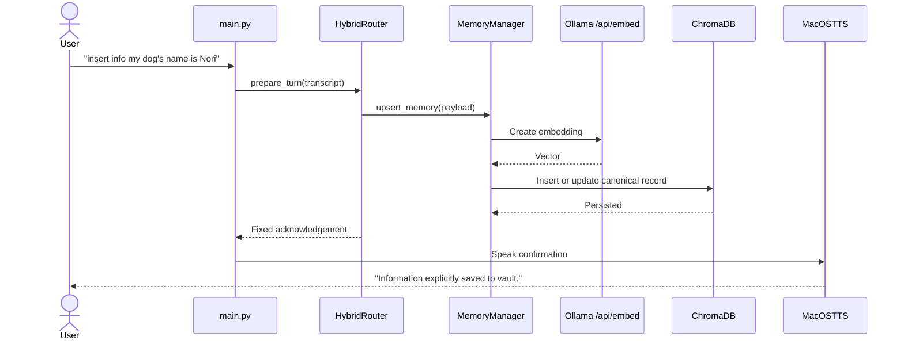
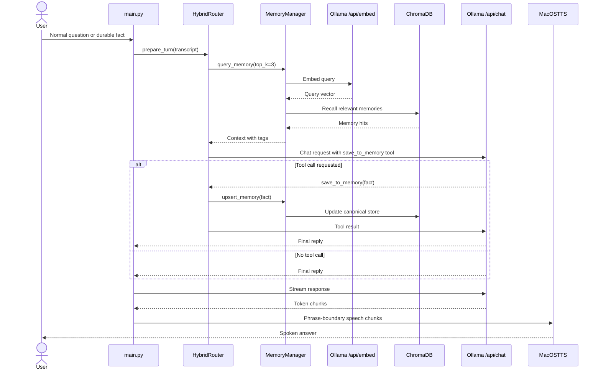
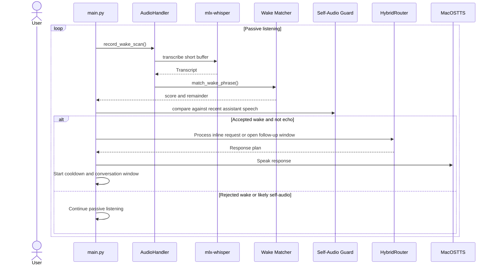

# Lulu VAIA

Lulu VAIA is a fully local, Apple Silicon-first voice-to-voice AI assistant for macOS. It uses `mlx-whisper` for speech-to-text, Ollama for chat plus embeddings, ChromaDB for persistent long-term memory, and the native macOS `say` command for zero-setup text-to-speech.

This current product baseline is designed for a Mac M1 workflow in July 2026:

- No cloud inference
- No CUDA
- No PyTorch/CUDA runtime
- Native Ollama endpoints on `http://localhost:11434`
- Persistent semantic memory in `./vault_db`

## Documentation

- [Documentation Index](./docs/README.md)
- [Reconstructed Product Requirements Document](./docs/prd.md)
- [Decision Log](./docs/decision-log.md)
- [Original Project Blueprint](./Project_Blueprint_AI_Assistant.md)

Use these docs by role:

- `README.md`: setup, runtime modes, and day-to-day operator guidance
- `docs/prd.md`: reconstructed product scope, requirements, user stories, and success metrics
- `docs/decision-log.md`: strategic and technical rationale behind the current architecture
- `Project_Blueprint_AI_Assistant.md`: original vision and early design intent

## What Lulu Does

Lulu has a hybrid memory router with two paths:

### 1. Explicit Memory Save

If you say:

```text
insert info my dog's name is Nori
```

Lulu will:

1. Skip the chat model
2. Embed the payload with `nomic-embed-text`
3. Deduplicate semantically against existing canonical memories
4. Assign 1-3 backend tags locally
5. Insert or update the canonical memory in ChromaDB
6. Confirm with speech: `Information explicitly saved to vault.`

### 2. Autonomous Chat + Tool-Calling Memory

For normal speech, Lulu will:

1. Query ChromaDB for the top 3 relevant memories
2. Inject those memories, including their backend tags, into the system prompt
3. Call Ollama `POST /api/chat` with a JSON-schema tool named `save_to_memory`
4. Let the model decide whether the user shared a durable fact worth remembering
5. Save the fact natively in Python if the tool is called
6. Generate a final spoken reply

The router intentionally allows only one tool-execution round per turn to avoid recursive tool loops.

### Canonical Memory Rules

Lulu now stores long-term memory as canonical records:

- semantic near-duplicates update the existing record instead of creating noisy copies
- backend classification assigns 1-3 free-form tags such as `tea`, `preference`, `schedule`, or `dentist`
- conflicting facts in the same semantic slot follow latest-wins behavior
- recalled memories show both text and tags to the model for better context quality

## Architecture

```text
Microphone
  -> sounddevice + numpy VAD
  -> mlx-whisper transcription
  -> HybridRouter
     -> Explicit path: Chroma upsert
     -> Chat path:
        -> Chroma semantic recall
        -> Ollama /api/chat
        -> optional save_to_memory tool call
        -> final reply
  -> macOS say
```

## Core System Flows

### Explicit Memory Save



### Conversational Turn With Optional Memory Tool



### Continuous Listening And Wake Flow



## Project Structure

```text
.
├── .gitignore
├── README.md
├── Project_Blueprint_AI_Assistant.md
├── docs
│   ├── README.md
│   ├── decision-log.md
│   └── prd.md
├── audio_handler.py
├── config.py
├── llm_router.py
├── main.py
├── memory_manager.py
├── ollama_client.py
├── terminal_ui.py
├── requirements.txt
├── scripts
│   └── memory_inspect.py
└── tests
    ├── test_continuous_listening.py
    ├── test_llm_router.py
    ├── test_memory_manager.py
    └── test_streaming_tts.py
```

## Apple Silicon Setup

### 1. Install system dependencies

```bash
brew update
brew install python@3.12 portaudio ffmpeg ollama
```

Notes:

- `portaudio` is required by `sounddevice`
- `ffmpeg` is useful for audio tooling and troubleshooting
- `ollama` provides the local model runtime

### 2. Create a virtual environment

```bash
python3.12 -m venv .venv
source .venv/bin/activate
python -m pip install --upgrade pip setuptools wheel
pip install -r requirements.txt
```

### 3. Start Ollama

If the desktop app is not already running:

```bash
ollama serve
```

### 4. Pull the local models

```bash
ollama pull llama3.2:3b
ollama pull nomic-embed-text
```

Optional STT model choice is configured by environment variable:

- Fastest default: `mlx-community/whisper-tiny-mlx`
- Better accuracy: `mlx-community/whisper-base-mlx`

### 5. Verify Ollama

```bash
curl http://localhost:11434/api/version
curl http://localhost:11434/api/tags
```

### 6. Grant microphone permission

On first use, macOS should prompt for microphone access for the terminal or IDE host process running Lulu.

## Run Lulu

### Voice mode

```bash
python main.py
```

Lulu now runs in always-on passive listening mode by default. It waits for the fixed wake phrase `hey lulu`, uses a conservative scored matcher to tolerate common Whisper-style confusions such as `hay lou lou`, opens a 12-second follow-up conversation window, then returns to passive listening automatically after the window expires.

The terminal now shows a small live dashboard with:

- current assistant mode such as `passive_listening`, `conversation_window`, `thinking`, and `speaking`
- a visible runtime badge showing `CONTINUOUS`, `TURN-BASED`, or `TEXT`
- a wake debug panel with the current score threshold, accepted/rejected counters, score bins, and recent accepted/rejected wake attempts
- latest transcript and spoken response
- recent memory saves
- a recent-turn event log for capture, transcription, recall, save, and response milestones
- per-turn latency snapshots for capture, STT, router, TTS, and total turn time

Replies now stream into speech in phrase-sized chunks, so Lulu can begin talking before the full response is complete. This phrase-boundary policy favors lower latency today, but it may sound choppier than sentence-sized chunks and is intentionally isolated so it can be swapped later if user testing prefers smoother playback.

While Lulu is speaking and briefly afterward, wake detection enters a software cooldown so the assistant does not immediately retrigger on its own TTS output. Lulu also applies a lightweight transcript-similarity guard for a short post-speech window to suppress likely self-audio echoes by comparing wake-scan transcripts against the recent final reply and recently spoken chunks.

### Text-input mode

This is useful for quick router and memory testing without live audio:

```bash
python main.py --text-input
```

### Turn-based troubleshooting mode

Use this temporary fallback to bypass continuous listening and return to the older one-turn voice loop:

```bash
python main.py --turn-based
```

### Memory inspection mode

Use the text-mode sanity script to inspect stored canonical memories without modifying the database:

```bash
python scripts/memory_inspect.py --limit 10
python scripts/memory_inspect.py --query "What tea do I like?" --limit 3 --show-metadata
```

This is useful for checking:

- whether a repeated fact was merged instead of duplicated
- what backend tags were assigned
- which memory a semantic query would recall

## Environment Variables

You can override defaults without changing code:

```bash
export OLLAMA_BASE_URL="http://localhost:11434"
export OLLAMA_CHAT_MODEL="llama3.2:3b"
export OLLAMA_EMBED_MODEL="nomic-embed-text"
export MLX_WHISPER_MODEL="mlx-community/whisper-tiny-mlx"
export CHROMA_PATH="./vault_db"
export CHROMA_COLLECTION="lulu_memory"
export VAD_THRESHOLD="0.015"
export VAD_SILENCE_SECONDS="1.0"
export TOP_K_MEMORIES="3"
export MEMORY_DEDUP_SIMILARITY_THRESHOLD="0.92"
export MEMORY_DEDUP_QUERY_K="3"
export MEMORY_MAX_TAGS="3"
export MEMORY_TAG_CLASSIFIER_MODEL=""
export WAKE_PHRASE="hey lulu"
export WAKE_SCAN_MAX_RECORD_SECONDS="2.0"
export WAKE_SCAN_MIN_SPEECH_SECONDS="0.20"
export CONVERSATION_WINDOW_SECONDS="12.0"
export WAKE_COOLDOWN_SECONDS="1.2"
export SELF_AUDIO_GUARD_SECONDS="8.0"
export SELF_AUDIO_SIMILARITY_THRESHOLD="0.74"
export WAKE_MATCH_SCORE_THRESHOLD="0.86"
export CONTINUOUS_LISTENING_ENABLED="true"
```

## Important Implementation Notes

### Ollama Tool Calling

Lulu uses the native Ollama endpoint:

- Chat: `POST /api/chat`
- Embeddings: `POST /api/embed`

This matters because tool calls are handled using Ollama's native `tool_calls` format. The app does not rely on the OpenAI-compatible `/v1` layer for tool execution.

Tool follow-up messages are formatted like this:

```json
{
  "role": "assistant",
  "tool_calls": [
    {
      "type": "function",
      "function": {
        "name": "save_to_memory",
        "arguments": {
          "fact": "My flight is at 5 PM tomorrow."
        }
      }
    }
  ]
}
```

Then the Python app replies with a tool message:

```json
{
  "role": "tool",
  "tool_name": "save_to_memory",
  "content": "Saved memory: My flight is at 5 PM tomorrow."
}
```

### Safety Guardrails

- The model can request only one supported tool: `save_to_memory`
- Only one tool round is executed per user turn
- Tool arguments must be a JSON object
- `fact` must be a non-empty string within a configurable max length
- Memory deduplication uses a configurable semantic threshold and keeps one canonical active record
- Backend tag classification is validated in Python and falls back to `general` on parse failures
- Retrieved memory is treated as untrusted context, not executable instruction text
- TTS uses the native `say` binary through `subprocess.run([...])` instead of shell-interpolating model output
- Chunked playback is currently non-interruptible; interruption work is deferred to a future playback milestone

## Testing

Run the focused test suite:

```bash
pytest -q
```

## Tuning Tips For M1

- Use `mlx-community/whisper-tiny-mlx` for the lowest STT latency
- Move to `mlx-community/whisper-base-mlx` if recall quality matters more than raw speed
- Keep the chat model small for fast turn-taking
- If memory recall feels noisy, reduce `TOP_K_MEMORIES` to `2`
- If VAD misses speech, lower `VAD_THRESHOLD`
- If VAD clips too early, increase `VAD_SILENCE_SECONDS`

## Roadmap Ideas

- Replace macOS `say` with a higher-quality local TTS engine
- Add barge-in or interruption support during assistant playback
- Add memory confidence scoring
- Add richer structured memory taxonomies or human-reviewed conflict resolution
- Add explicit latency benchmarking and automated calibration reports

## Troubleshooting

### `Connection refused` from Ollama

Start Ollama:

```bash
ollama serve
```

### `PortAudio` or input stream errors

Reinstall audio dependencies:

```bash
brew install portaudio
pip install --force-reinstall sounddevice
```

### Whisper is too slow

Use:

```bash
export MLX_WHISPER_MODEL="mlx-community/whisper-tiny-mlx"
```

### No memories are being recalled

Check that `vault_db/` is being created and that you have saved facts with either:

- `insert info ...`
- natural prompts that trigger `save_to_memory`

## License

Choose the license that matches your intended use before publishing the repo.
