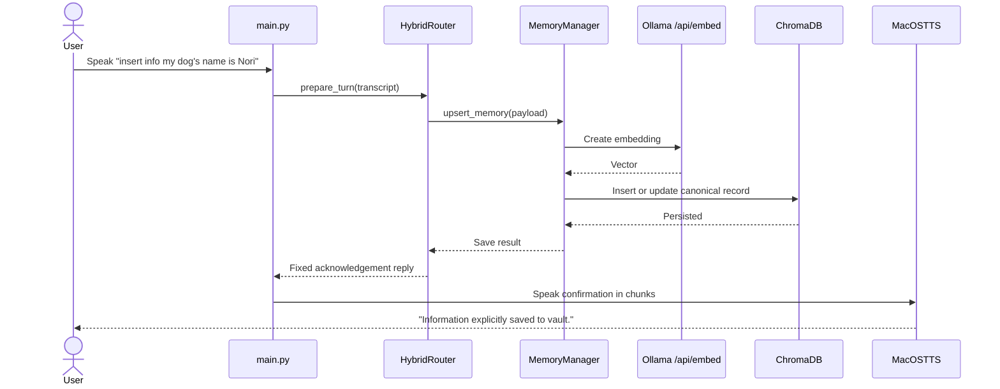
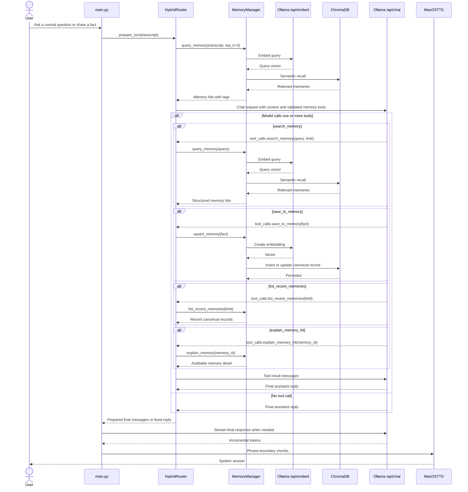
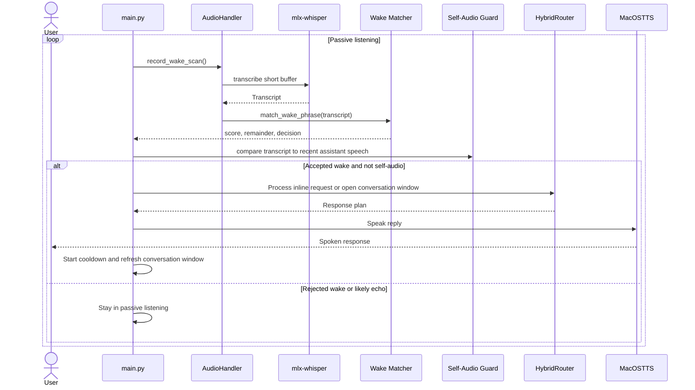
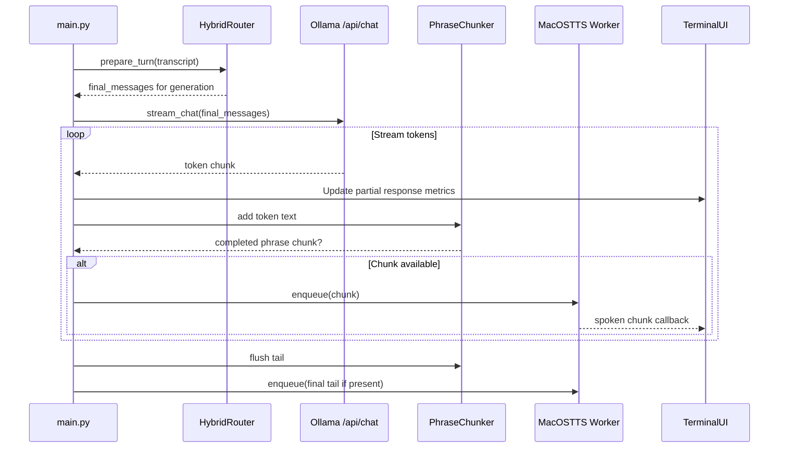

# Lulu VAIA Product Requirements Document

## Document Control

| Field | Value |
| --- | --- |
| Status | Reconstructed from implemented product behavior |
| Version | 1.0 |
| Date | 2026-07-01 |
| Product | Lulu VAIA |
| Platform | macOS on Apple Silicon |
| Primary Audience | Product, engineering, and future maintainers |
| Source Basis | Repository code, focused tests, README, blueprint, and phase plans |

Related documents:

- [Documentation Index](./README.md)
- [Decision Log](./decision-log.md)
- [Original Project Blueprint](../Project_Blueprint_AI_Assistant.md)

## 1. Executive Summary

Lulu VAIA is a fully local, low-latency, voice-to-voice AI assistant for macOS on Apple Silicon. It combines local speech transcription, local LLM chat, persistent semantic memory, and native text-to-speech into a single operator-facing workflow that runs without cloud inference.

The product is designed to solve a specific user problem: most assistants are either cloud-dependent, weak at long-term personalized memory, difficult to debug locally, or poorly optimized for a Mac-first development workflow. Lulu addresses that gap with a local-first stack, a hybrid memory model, continuous listening with a wake phrase, and an observability-focused terminal interface.

This PRD reconstructs the product requirements from the shipped implementation and formalizes missing requirements that were previously implicit or spread across code, tests, and phase plans.

## 2. Problem Statement

Users need a private, always-available local assistant that can:

- respond to natural voice interaction on a Mac without relying on cloud APIs
- remember durable facts over time without forcing every memory write through manual tooling
- remain inspectable and debuggable during rapid iteration
- operate with low enough perceived latency to feel conversational

Existing alternatives commonly fail one or more of these requirements by depending on cloud services, lacking persistent personalized memory, or hiding runtime behavior behind black-box interfaces.

## 3. Product Goals

### 3.1 Goals

- Deliver a fully local assistant runtime for Apple Silicon Macs.
- Support both explicit and autonomous long-term memory capture.
- Preserve low perceived latency for end-to-end voice interaction.
- Provide a practical always-on interaction model with wake phrase gating.
- Expose enough runtime state for calibration, debugging, and future iteration.

### 3.2 Non-Goals

- Human-like premium voice quality in the current release.
- Barge-in or interruptible playback in the current release.
- Multi-user identity, account management, or cloud sync.
- Rich GUI or mobile clients.
- General-purpose multi-agent orchestration beyond the single memory tool path.

## 4. Users And Personas

### 4.1 Primary End User

An individual Mac user who wants a private assistant that can remember preferences, schedules, and recurring facts while remaining local and responsive.

### 4.2 Secondary User

A developer or maintainer who needs to observe, tune, and extend the assistant's runtime behavior with clear diagnostics and modular boundaries.

## 5. Product Scope

### 5.1 In Scope For The Current Product Baseline

- Voice input via microphone capture and VAD-based recording
- Local STT using `mlx-whisper`
- Local chat and embedding generation through Ollama
- Persistent semantic memory in ChromaDB
- Explicit memory storage via `insert info ...`
- Autonomous memory storage, read-only lookup, and auditable memory inspection via a validated backend tool registry
- Phrase-boundary streamed speech output using macOS `say`
- Continuous listening with fixed wake phrase `hey lulu`
- Short active conversation window after wake
- Cooldown and self-audio suppression safeguards
- Terminal dashboard with status, latencies, memory events, and wake diagnostics
- Turn-based fallback mode for troubleshooting
- Read-only memory inspection utility

### 5.2 Out Of Scope For The Current Product Baseline

- Cloud-hosted inference or storage
- Speaker diarization or multi-user profiles
- Voice interruption while Lulu is speaking
- Visual UI beyond the terminal dashboard
- Automatic conflict resolution with human approval workflows
- Structured calendar, email, or external SaaS integrations

## 6. Product Overview

Lulu uses a hybrid router with two main behavior paths:

- An explicit command path for deterministic memory writes
- A conversational path that recalls memory, lets the model optionally request bounded memory tools, and then produces a final spoken reply

For user-facing operation, the current baseline distinguishes three invocation outcomes:

- deterministic explicit-save commands such as `insert info ...`
- natural-language turns that may trigger validated memory tools such as `save_to_memory`, `search_memory`, `list_recent_memories`, or `explain_memory_hit`
- normal chat turns that produce a reply without any backend action

The product supports two runtime modes:

- `CONTINUOUS`: passive wake listening, active follow-up window, cooldown, and self-audio suppression
- `TURN-BASED`: older one-turn voice flow for troubleshooting

### 6.1 Core Terms

- Durable fact: a user fact expected to remain useful across future turns, such as a preference, relationship, routine, or schedule detail stated as plain text.
- Backend tags: 1-3 locally assigned free-form labels used to improve memory recall context quality.
- Semantic slot: the conceptual fact bucket used to decide whether a new memory updates an existing canonical fact instead of creating a duplicate.
- Low perceived latency: response behavior optimized to start useful feedback quickly through grouped smoothness-first streaming rather than waiting for the full model response.
- Always-available: Lulu can remain ready in passive listening mode on a supported Mac, but it is still bounded by local device resources, permissions, and model availability.

### 6.2 Current Operating Defaults

The current shipped baseline uses these defaults unless overridden by environment configuration:

- wake phrase: `hey lulu`
- practical voice preset: available, but disabled by default
- memory recall depth: top `3` memories
- tool round limit: `2`
- tool calls per round limit: `2`
- conversation window: `12.0` seconds
- wake cooldown: `1.2` seconds
- self-audio guard window: `8.0` seconds
- self-audio similarity threshold: `0.74`
- wake match score threshold: `0.84`
- wake probabilistic confidence threshold: `0.73`
- wake acoustic candidate threshold: `0.54`
- wake fast-path threshold: `0.89`

### 6.3 Runtime Ownership Boundary

`HybridRouter` owns turn preparation, explicit-save bypass behavior, memory recall, and optional tool execution. `main.py` owns runtime orchestration through `RuntimeController`, final streaming generation, TTS chunk delivery, and mode-specific control flow.

## 7. Core Workflow Diagrams

### 7.1 Explicit Memory Save

### 7.2 Conversational Turn With Optional Autonomous Memory Tools

### 7.3 Continuous Listening, Wake Detection, And Follow-Up Window

### 7.4 Streamed Response Playback

## 8. Functional Requirements

### FR-1 Local-Only Runtime

The product shall run end-to-end on the local machine for chat, embeddings, transcription, memory storage, and speech output.

### FR-2 Apple Silicon Optimization

The product shall target Apple Silicon Macs and avoid dependencies that require CUDA or PyTorch/CUDA.

### FR-3 Voice Runtime Modes

The product shall support:

- continuous listening as the default voice mode
- turn-based voice mode for troubleshooting

### FR-4 Speech Capture And Transcription

The product shall capture microphone audio, stop on silence for active turns, and transcribe audio locally with `mlx-whisper`.

### FR-5 Explicit Memory Save Path

If a transcript begins with `insert info`, the product shall bypass the chat-generation path and perform a direct memory save followed by a spoken acknowledgement.

### FR-6 Semantic Recall For Normal Turns

For non-explicit turns, the product shall query persistent memory and provide the top relevant memories to the conversational model as contextual input.

### FR-7 Autonomous Memory Tool Calling

The conversational model shall have access only to allowlisted memory tools exposed through the backend registry. The current baseline supports `save_to_memory`, `search_memory`, `list_recent_memories`, and `explain_memory_hit`, and the backend shall enforce bounded tool rounds and bounded tool calls per round.

### FR-8 Auditable Memory Metadata

Canonical memory records shall preserve typed metadata including primary category, source semantics, revision count, and update timestamps so tool results and operator inspection can explain what Lulu stored and how it changed.

### FR-9 Canonical Long-Term Memory

The product shall store long-term facts as canonical records, deduplicate near-duplicates semantically, apply backend tags, and use latest-wins behavior for conflicting facts in the same semantic slot.

### FR-10 Streamed Spoken Responses

The product shall begin speech playback before the full model response is complete by chunking the response at phrase boundaries and queueing native TTS playback.

### FR-11 Continuous Listening

The product shall support passive wake scanning with a fixed wake phrase, an active follow-up conversation window, and automatic return to passive listening after the window expires.

### FR-12 Wake Robustness

Wake detection shall tolerate common transcription confusions through scored matching rather than exact string equality.

### FR-13 Self-Audio Suppression

The product shall reduce assistant self-triggering by combining a cooldown period with transcript similarity checks against recent assistant speech.

### FR-14 Operator Observability

The terminal dashboard shall expose runtime mode, state transitions, recent transcript and response, memory events, invocation path, tool-state summaries, latency snapshots, wake attempt diagnostics, and event logs.

### FR-15 Manual Memory Inspection

The product shall provide a read-only utility for inspecting stored memory content and semantic recall behavior without modifying the database.

### FR-16 Safe Tool And Output Handling

The backend shall validate tool arguments against registered schemas, execute only allowlisted backend tools, return structured tool success and failure payloads, treat recalled memory as untrusted context, and invoke TTS without shell interpolation.

### FR-17 Dependency Failure Handling

The product shall expose degraded but understandable behavior when a core dependency is unavailable.

- If Ollama is unavailable at startup, the product shall surface that state clearly instead of failing silently.
- If microphone capture or permission fails, the product shall surface an actionable operator-visible error.
- If memory storage or recall fails for a turn, the product shall avoid corrupting the active session and shall keep the failure visible in operator-facing output.
- If TTS playback fails, the product shall preserve the final text response in the UI even when spoken output is incomplete.

## 9. Non-Functional Requirements

### NFR-1 Privacy

All inference and storage shall remain local to the device during normal operation. No cloud dependency shall be required for the core product workflow.

### NFR-2 Responsiveness

The product shall optimize for low perceived latency by:

- using lightweight local models
- starting playback before full response completion
- keeping explicit memory saves on a direct path that bypasses unnecessary chat generation

Exact latency budgets are not yet instrumented as hard release gates in the repository and should be added in future benchmarking work.

### NFR-3 Reliability

The product shall fail safely when:

- a tool payload is malformed
- a tool request targets an unsupported tool
- tag classification parsing fails
- no speech is detected
- a wake attempt falls below threshold

The product shall avoid recursive tool loops by design through explicit backend round limits, per-round tool-call limits, and a final reply path that does not re-open tool execution.

### NFR-4 Maintainability

The system shall remain modular with clear boundaries for audio capture, routing, memory, model access, and UI.

### NFR-5 Observability

The product shall surface enough internal state to debug wake calibration, streaming behavior, memory saves, and turn timing from the terminal UI alone.

### NFR-6 Configurability

Operational thresholds and model choices shall be configurable by environment variables rather than hard-coded only in source files.

The current product baseline expects the documented defaults in Section 6.2 to remain the reference configuration unless intentionally changed.

### NFR-7 Safety And Integrity

Memory writes shall occur through validated backend logic, not direct model-side persistence. Retrieved memory shall be treated as input context rather than executable instruction text.

### NFR-8 Platform Simplicity

The release shall prefer native or low-friction local components when they materially reduce setup burden, even if higher-fidelity alternatives exist for later phases.

## 10. User Stories And Acceptance Criteria

### Epic A: Capture And Remember Durable Facts

#### Story A1

As an end user, I want to explicitly save a fact by speaking a command so that I can control what Lulu remembers.

Acceptance criteria:

- Given a transcript that starts with `insert info`, when Lulu processes the turn, then it bypasses the normal chat reply path.
- Given a valid explicit memory payload, when the save succeeds, then Lulu stores or updates a canonical memory record.
- Given a successful explicit save, when the turn completes, then Lulu speaks a fixed confirmation response.

#### Story A2

As an end user, I want Lulu to remember durable facts I mention naturally so that I do not have to use a command every time.

Acceptance criteria:

- Given a non-explicit conversational turn, when the model identifies a durable fact, then it may call `save_to_memory`.
- Given a non-explicit conversational turn, when the user asks what Lulu remembers, then the model may call `search_memory`.
- Given a non-explicit conversational turn, when the user asks for the latest remembered items, then the model may call `list_recent_memories`.
- Given a prior memory tool result containing a memory id, when the user asks for more detail about that entry, then the model may call `explain_memory_hit`.
- Given a tool call request, when the payload passes the registered schema and backend validation, then the backend executes the allowlisted memory tool and hands the result into the final generation path.
- Given a malformed or unsupported tool request, when the backend rejects it, then Lulu returns a structured error payload instead of executing an unsafe action.
- Given a turn with no durable fact, when the model responds, then no memory save is executed.

#### Story A3

As an end user, I want duplicate memories to be merged so that my long-term memory stays clean and useful.

Acceptance criteria:

- Given a new fact that is semantically equivalent to an existing fact, when it is saved, then Lulu updates the canonical record instead of creating a noisy duplicate.
- Given conflicting facts in the same semantic slot, when the new fact is accepted, then the latest fact becomes the active canonical value.

### Epic B: Ask Questions With Context

#### Story B1

As an end user, I want Lulu to recall relevant personal context during a normal conversation so that answers stay personalized.

Acceptance criteria:

- Given a normal conversational turn, when Lulu prepares the prompt, then it retrieves the top relevant memories from ChromaDB.
- Given recalled memories, when the model is called, then those memories are included as prompt context along with their backend tags.

#### Story B2

As an end user, I want Lulu to answer naturally even when no memory is relevant so that the assistant still works as a general local conversational agent.

Acceptance criteria:

- Given a normal turn with no useful recall, when the model is invoked, then Lulu still produces a conversational reply.
- Given no memory hits, when the turn completes, then Lulu does not fail or block the user flow.

### Epic C: Speak Back Quickly

#### Story C1

As an end user, I want Lulu to start speaking before the full reply is complete so that the interaction feels faster.

Acceptance criteria:

- Given a generated reply longer than a short phrase, when streaming tokens arrive, then Lulu groups text into smoothness-first chunks that prefer sentence boundaries before falling back to clause-aware breaks or hard splits.
- Given a streamed reply, when a grouped chunk is ready, then it is queued for TTS in order.

#### Story C2

As an end user, I want Lulu's speech playback to remain predictable during the current release so that the system is stable even if interruption is not yet supported.

Acceptance criteria:

- Given active playback, when new audio chunks are enqueued, then they play in order on the TTS worker.
- Given the current product baseline, when Lulu is speaking, then barge-in is not expected behavior.

### Epic D: Use Lulu Hands-Free

#### Story D1

As an end user, I want Lulu to wake when I say `hey lulu` so that I can use it without starting each turn manually.

Acceptance criteria:

- Given a passive listening session, when the wake transcript matches or exceeds the scored threshold, then Lulu accepts the wake attempt.
- Given an accepted wake attempt with an inline request, when the turn is processed, then Lulu handles the request immediately.
- Given an accepted wake attempt without a remainder, when the wake is processed, then Lulu opens the follow-up conversation window.

#### Story D2

As an end user, I want a short follow-up window after waking Lulu so that I can ask a second question naturally.

Acceptance criteria:

- Given a successful wake, when the reply completes, then Lulu keeps an active conversation window for the configured duration.
- Given silence until the deadline passes, when the window expires, then Lulu returns to passive listening.

#### Story D3

As an end user, I do not want Lulu to wake on its own voice so that playback does not loop back into the assistant.

Acceptance criteria:

- Given active or very recent assistant speech, when the wake scan transcript is highly similar to recent assistant output, then Lulu suppresses the wake attempt.
- Given immediate post-speech time, when cooldown is active, then wake detection is temporarily skipped.

### Epic E: Operate And Debug The Product

#### Story E1

As a developer or maintainer, I want to see live runtime state so that I can debug capture, transcription, memory, and wake behavior.

Acceptance criteria:

- Given the terminal dashboard is running, when Lulu changes mode or completes a turn stage, then the relevant UI panels update.
- Given wake scanning is active, when a wake attempt is evaluated, then accepted or rejected counts, recent attempts, success rate, average wake score, top rejection reasons, and guidance are visible.
- Given a completed turn, when the user reviews the UI, then latency snapshots, speech continuity indicators, and recent events are available.

#### Story E2

As a developer or maintainer, I want safe troubleshooting modes so that I can isolate failures without disabling core product behavior permanently.

Acceptance criteria:

- Given the `--turn-based` flag, when Lulu starts, then it bypasses continuous listening and uses the older one-turn voice loop.
- Given the memory inspection script, when it is run, then it reads stored memory without modifying the database.

## 11. Success Metrics

These metrics formalize product outcomes that were implicit in the implementation but not previously documented. Some are design targets and require additional instrumentation for full automated tracking.

### 11.1 Product Metrics

- Local execution coverage: 100% of core runtime inference, transcription, embeddings, and memory operations execute locally.
- Explicit save completion: explicit memory-save requests complete successfully without entering the normal chat-generation path.
- Contextual response coverage: normal turns query memory before generation.
- Streamed response usage: non-trivial model replies begin TTS playback before the full response has completed.
- Wake flow completion: accepted wake attempts either process an inline request or open the configured follow-up window.

### 11.2 Quality Metrics

- Duplicate memory suppression: semantically equivalent facts converge on one canonical record instead of accumulating noisy duplicates.
- Wake rejection quality: clear non-wake phrases remain below the configured wake threshold during calibration runs.
- Self-audio suppression quality: recent assistant speech does not retrigger the assistant during cooldown and short post-speech guard windows.
- Observability completeness: runtime mode, latest turn state, latency snapshots, and wake diagnostics remain visible from the terminal UI.

### 11.3 Delivery Metrics

- Requirements traceability: all shipped core workflows are represented in this PRD and in sequence diagrams.
- Documentation accessibility: the PRD and decision log are linked from the top-level documentation surface.
- Focused validation: regression tests cover router behavior, memory semantics, streaming TTS, continuous-listening edge cases, and dependency-failure handling for startup, capture, transcription, streaming, and TTS boundaries.

## 12. Risks, Constraints, And Tradeoffs

- Wake performance depends on transcription quality because wake detection is transcript-gated instead of using a dedicated wake-word model.
- Native macOS `say` lowers setup complexity but limits voice quality and interruption control.
- Native macOS `say` still restarts per chunk, so some seams can remain even with grouped playback and tail-merge heuristics.
- Canonical memory improves recall quality, and the current baseline now exposes lightweight revision counts and source/category metadata without implementing destructive edit history or full user-managed versioning.
- Low perceived latency is a product goal, but explicit benchmark thresholds are still an area for future instrumentation work.
- The current product prioritizes a single-user local workflow and does not address multi-device synchronization or collaboration.

## 13. Release Boundaries

### 13.1 Current Release Includes

- local voice interaction
- hybrid memory routing
- canonical semantic memory
- grouped smoothness-first streamed TTS
- continuous listening, scored wake gating, and wake guidance diagnostics
- observability-focused terminal dashboard

### 13.2 Next Likely Extensions

- higher-quality fully local TTS
- playback interruption or barge-in
- richer structured memory taxonomy or confidence scoring
- broader benchmarking and latency instrumentation
- optional multimodal or tool-surface expansion

## 14. Traceability Summary

The reconstructed requirements align with shipped implementation coverage in:

- `tests/test_llm_router.py`
- `tests/test_memory_manager.py`
- `tests/test_streaming_tts.py`
- `tests/test_continuous_listening.py`

## 15. Document Revision History

| Date | Version | Change | Author |
| --- | --- | --- | --- |
| 2026-07-01 | 1.0 | Initial reconstructed PRD created from code, tests, README, blueprint, and implementation plans | Repository documentation update |
| 2026-07-02 | 1.1 | Aligned product wording with grouped streamed TTS, wake guidance metrics, and current dashboard observability | Repository documentation update |
